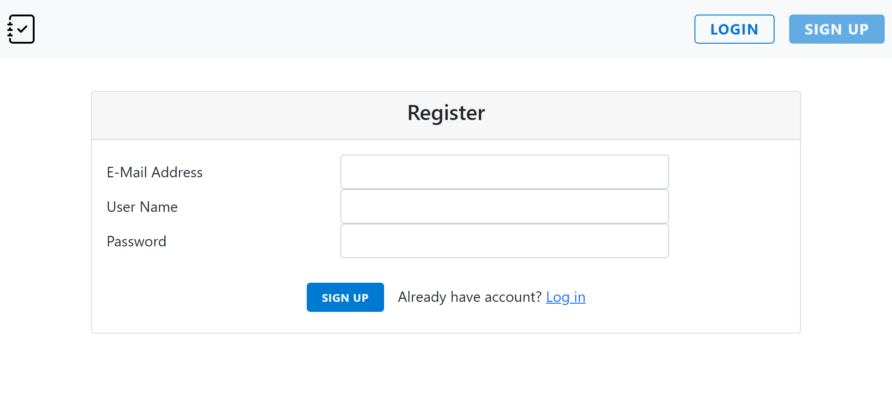
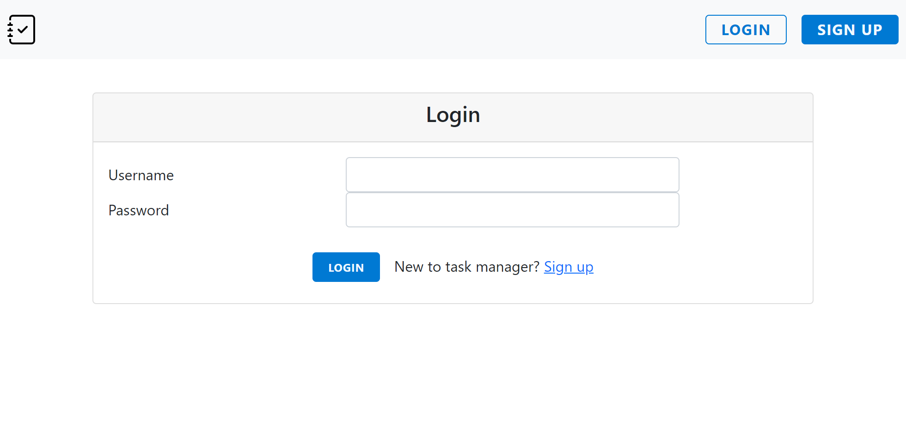
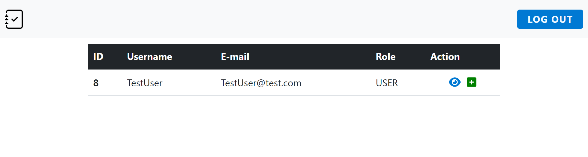
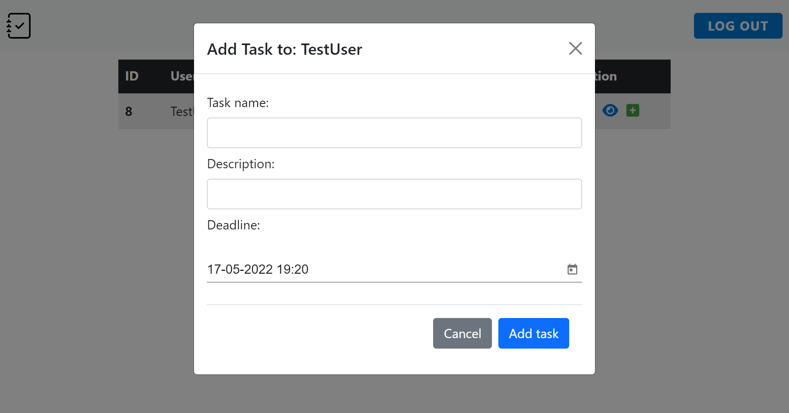
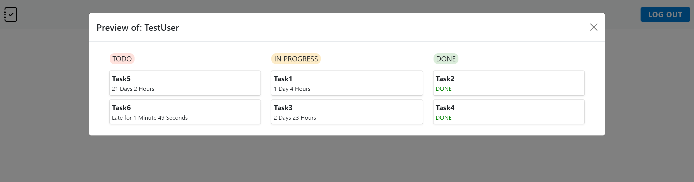
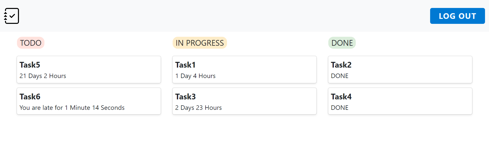

# Employee task management tool

## Description

This is a full-stack (spring-boot backend + angular frontend) application for management employees tasks.
Emloyees have board view of theirs tasks and they can switch status of them between todo, in progress and done. Employer can add new tasks to every activated user (new user have to activate his account by clicking on the link in the e-mail sent after registration). Every task have name, descritpion and dead line which is conveniently displayed to employees.

## Used technologies:

* [Java - backend](src/main/java/io/github/M1lY/employeetaskmanagementtool)
  * spring-boot
  * hibernate - mysql
  * spring-security - JWT based authentication
* [Angular - frontend](src/main/ui)
  * bootstrap

## Screenshots:

